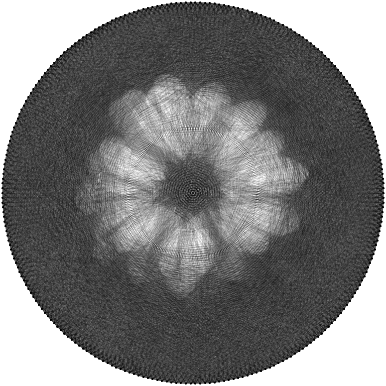
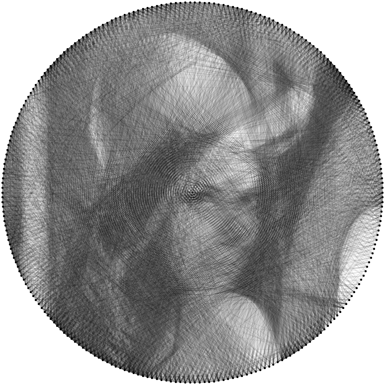
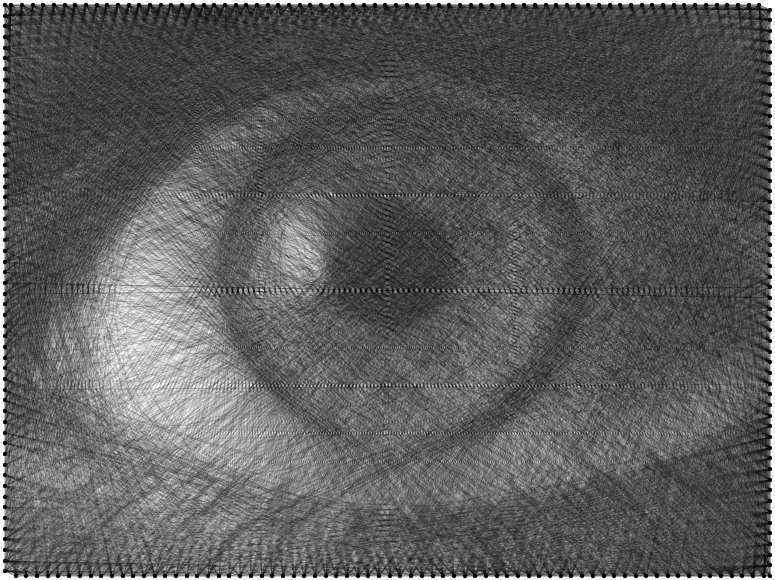
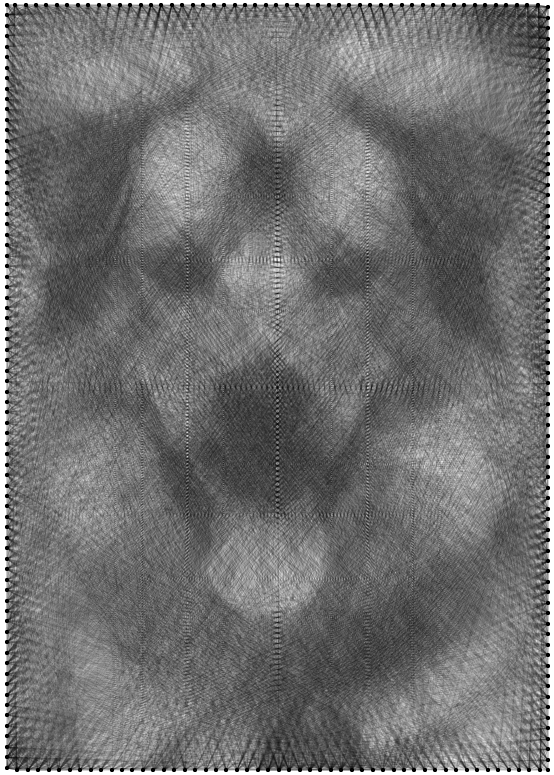

# String Art Generator

Turn any photo into string art — right in your browser. Choose a circle, square, landscape, portrait, hexagon or oval board, generate the art, then download a **printable numbered nail template** and the **winding sequence** to build it for real.


**Live demo:** `[String Art Generator](https://chanchalsakardeqh.github.io/Custom-Base-Board-String-Art-Portrait-Webtool/)`

## Features

* Converts any image into string-art style.
* Board shapes: **Circle**, **Square**, **Landscape**, **Portrait** (A-series 1:√2 ratio), **Hexagon** (flat top or pointy top), **Oval** (horizontal or vertical, 1:√2), or **Match image**.
  * Hexagon nails are shared out side by side so every corner gets a nail. Use a nail count that's a multiple of 6 (e.g. 240 or 252) for perfectly even spacing.
  * Oval nails are spaced evenly along the curve, not by angle, so they don't bunch up at the narrow ends.
* **Full-page workbench interface**: settings on the left, the board on a cutting-mat stage, and a progress thread with live stats while the art is drawn. On phones the board comes first and the Generate button stays pinned to the bottom of the screen.
* **Original ⇄ String art flip**: the board is a two-sided card. Flip it with the toggle above the board (or press **F**) to compare your photo, cropped exactly like the board, with the generated art. You can zoom and position the photo on either side. If your system is set to reduce motion, the flip becomes a crossfade.
* **Show nail numbers** on screen: every nail, every 5th or every 10th, with nail 1 in red. Handy for checking the layout before generating and for following the winding sequence. The numbers sit on a separate layer, so they never affect the generated art; PNG export includes them when they're switched on.
* Nail layouts: along the edge, grid, or random.
* Exports:
  * **Image (PNG)** – the rendered art.
  * **Vector (SVG)** – the art as scalable lines.
  * **Nail template (SVG, numbered)** – board outline plus every nail with its number. Print it at your board size, tape it on, and hammer a nail at each dot. Nail 1 is shown in red.
  * **Winding sequence (TXT)** – the order to wrap the thread, using the same nail numbers as the template.
  * **Project file (.stringart)** – JSON with nail coordinates, colors and the full sequence.

Image adjustments for a better result:

* brightness
* contrast
* invert brightness

Art settings:

* **Number of nails** – more nails allow a more accurate, detailed result.
* **Number of lines** – controls the level of detail.
* **Line opacity** – overlapping semi-transparent lines create shades of grey.
* **Line and background color** – in case you want to add some color.

**Positioning the image:** zoom with the mouse wheel (or pinch on touch screens) and drag to move it inside the board before generating. While generating, click **Pause**; click **Continue** to add more lines from where the thread stopped.

## How it works

1. Start at a nail, then decide which nail to draw the next line to.
2. For every possible line, compute the average brightness of the source-image pixels under it.
3. Pick the darkest line.
4. "Remove" that line from the source image by adding the opacity value to its pixels.
5. The nail at the end of that line becomes the new start, and the process repeats.

### About opacity

At 100% opacity a single line turns all of its pixels white, so the picture quickly fills in as a solid shape. Lower opacity lets lines stack up to build shades.

## Run it on GitHub Pages

This is a static site (plain HTML/CSS/JS, no build step), so GitHub Pages can serve it directly.

1. Create a new repository on GitHub and upload the contents of this folder (so `index.html` sits at the repository root).
2. Go to **Settings → Pages**.
3. Under **Build and deployment**, set **Source** to **Deploy from a branch**, choose **main** and **/ (root)**, then click **Save**.
4. After a minute or so the site is live at `https://<your-username>.github.io/<your-repo-name>/`.

Or from the command line:

```bash
cd StringArtGenerator
git init
git add .
git commit -m "String Art Generator"
git branch -M main
git remote add origin https://github.com/<your-username>/<your-repo-name>.git
git push -u origin main
```

Then enable Pages as in step 2–3 above.

## Run it locally

Open `index.html` directly in a browser, or serve the folder:

```bash
python3 -m http.server 8000
# then open http://localhost:8000
```

## Examples

<table>
    <tr>
        <td></td>
        <td></td>
    </tr>
    <tr>
        <td></td>
        <td></td>
    </tr>
</table>
