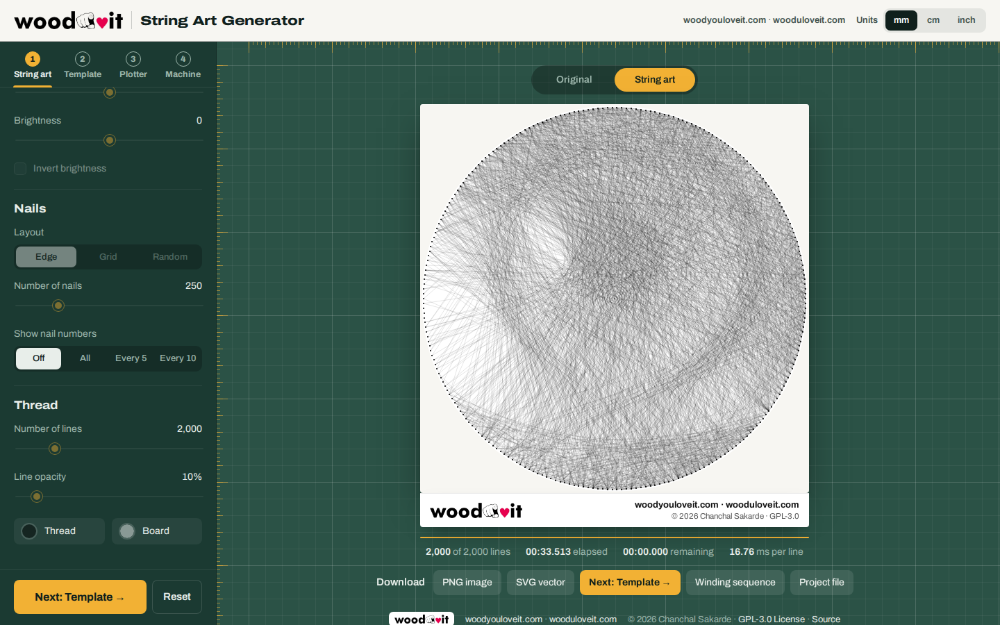
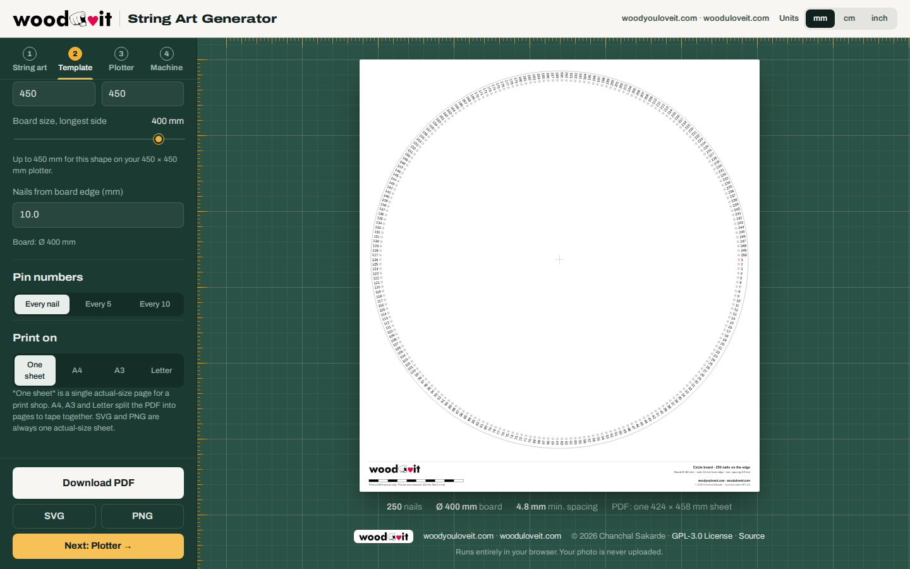

<p align="center">
  <a href="https://woodyouloveit.com"></a>
</p>

<h1 align="center">Custom Base Board String Art Portrait Webtool</h1>

<p align="center">
  Turn any photo into string art, or print an actual-size board template with every nail numbered.<br>
  By <a href="https://woodyouloveit.com">woodyouloveit.com</a> · <a href="https://wooduloveit.com">wooduloveit.com</a>
</p>

<p align="center">
  <a href="https://chanchalsakardeqh.github.io/Custom-Base-Board-String-Art-Portrait-Webtool/"><b>Open the live tool</b></a> ·
  <a href="ChangeLog.md">ChangeLog</a> ·
  <a href="https://github.com/ChanchalSakardeQH/Custom-Base-Board-String-Art-Portrait-Webtool#GPL-3.0-1-ov-file">GPL-3.0 License</a>
</p>

<p align="center">
  <a href="https://github.com/ChanchalSakardeQH/Custom-Base-Board-String-Art-Portrait-Webtool#GPL-3.0-1-ov-file"></a>
  
  
</p>



**New here? Read the [step-by-step user guide](docs/GUIDE.md)** with desktop and mobile screenshots of every step.

## Four steps, one flow

**1 String art → 2 Template → 3 Plotter → 4 Machine.** Generate the art once and every later step uses its board automatically; the Next buttons walk you through. Pick **mm, cm or inch** in the top bar: every size, speed and position on every tab switches straight away.

### String art

Load a photo, position it on the board, and watch the thread being drawn line by line. Then download the art and the winding sequence to build it for real.

### Board template (no photo needed)

Print an actual-size template with every nail position and its number. Tape it to your board, hammer a nail on each dot, then tear the paper away. You can make a template for a custom board, or one that uses the exact nails of the art you just generated.



### Plotter (GRBL G-code)

Let an XY plotter do the work. **Job 1** marks every nail position on the board with a pen, a Z-axis drill or a laser, optionally writing the pin numbers. **Job 2** winds the thread: a thread guide below the nail heads visits nails in the generated order and wraps each one with G2/G3 arcs. Travel moves that would clip a nail are routed round it. The preview shows the toolpath and the work zero, and **Play toolpath** traces it.

### Machine (run the plotter from the browser)

Connect your GRBL board over USB and run everything from the page: live status and position, jogging, work zero, homing and unlock, feed override, Job 1 and Job 2 straight from the Plotter tab (or any `.gcode` file) with pause, resume and a position-safe stop, M0 messages such as "Tie the thread to nail 1", a check-mode dry run, and a console for any command. A built-in **simulator** lets you rehearse without hardware.

USB needs **Chrome or Edge on a computer**, with the page served over **https** (GitHub Pages) or **localhost**. Phones, Firefox and Safari can't open serial ports yet; the simulator still works there. Close other programs that use the port (Arduino IDE, UGS, LaserGRBL) before connecting.

Before running on a machine: set work zero where the Plotter tab says (for example `G10 L20 P1 X0 Y0` at the board's bottom-left corner), run Job 1 with the pen lifted first to check the travel range, and check the wrap radius against your nail and guide sizes (the tab warns you).

## Features

* **Board shapes:** Circle, Square, Landscape, Portrait (A-series 1:√2), Hexagon (flat top or pointy top), Oval (horizontal or vertical, 1:√2), or Match photo.
  * Hexagon nails are shared out side by side so every corner gets a nail. Use a nail count that's a multiple of 6 (e.g. 240 or 252) for perfectly even spacing.
  * Oval nails are spaced evenly along the curve, so they don't bunch up at the narrow ends.
  * Nails are numbered in one continuous clockwise loop around every shape.
* **Nail layouts:** along the edge, grid, or random. Random layouts use a **pattern number**, so the same number always gives the same nails on every tab.
* **Original ⇄ String art flip:** the board is a two-sided card. Flip it with the toggle above the board (or press **F**) to compare your photo with the generated art.
* **Nail numbers on screen:** every nail, every 5th or every 10th, with nail 1 in red.
* **Board template:**
  * Real-world size in mm, cm or inches: set the board's longest side and how far the nails sit from the edge.
  * Pin numbers on every nail, every 5th or every 10th, rotated to read outward from the board.
  * Print on **one actual-size sheet** (for a print shop) or split across **A4, A3 or Letter** pages, with trim lines and page labels for taping together.
  * A 100 mm scale bar on every template so you can confirm it printed at 100%.
  * Warns you when nails would be closer than 3 mm.
* **Exports, all carrying the woodyouloveit logo, websites and copyright:**

| Export | What it is | Branding |
| --- | --- | --- |
| PNG image | The rendered art (with nail numbers if shown) | Logo, websites and copyright in a footer strip |
| SVG vector | The art as scalable lines | Logo footer, plus a title, description and comment |
| Winding sequence (TXT) | The order to wrap the thread | Header and footer lines |
| Project file (.stringart) | JSON with nails, colours and sequence | An `about` block with author, websites and licence |
| Board template PDF | Actual-size sheet or tiled pages | Title block with logo on the sheet, logo footer on every page, PDF metadata |
| Board template SVG | Actual-size sheet (sized in mm) | Title block with logo, title, description and comment |
| Board template PNG | Actual-size sheet at 300 DPI (DPI embedded) | Title block with logo |
| Nail G-code (.gcode) | GRBL job that marks every nail (pen, Z axis or laser) | Header comments |
| Winding G-code (.gcode) | GRBL job that winds the thread in sequence | Header comments |

## Using it

1. **String art:** click **Choose image** (or drop a photo on the page), pick a board shape, zoom and drag the photo into place, then press **Generate**. Press **Pause** at any time and **Continue** to add more lines.
2. **Board template:** open the **Board template** tab. Pick a shape, the number of nails, the board size and the paper, then **Download PDF**. To get the template for art you've generated, choose **Board template…** in the String art download row.

The numbers on a custom template match a String art run that uses the same shape, layout and number of nails.

## How the generator works

1. Start at a nail, then decide which nail to draw the next line to.
2. For every possible line, compute the average brightness of the source-image pixels under it.
3. Pick the darkest line.
4. "Remove" that line from the source image by adding the opacity value to its pixels.
5. The nail at the end of that line becomes the new start, and the process repeats.

At 100% opacity a single line turns all of its pixels white, so the picture quickly fills in as a solid shape. Lower opacity lets lines stack up to build shades.

## Run it on GitHub Pages

This is a static site (plain HTML, CSS and JavaScript, no build step), so GitHub Pages serves it directly.

1. Upload the contents of this folder to your repository, so `index.html` sits at the root.
2. Go to **Settings → Pages**.
3. Under **Build and deployment**, set **Source** to **Deploy from a branch**, choose **main** and **/ (root)**, then click **Save**.
4. After a minute or so the site is live at `https://<your-username>.github.io/<your-repo-name>/`.

## Run it locally

```bash
python3 -m http.server 8000
# then open http://localhost:8000
```

Opening `index.html` straight from disk also works, including PDF export (the PDF library is bundled in `js/vendor/`).

## Project layout

```
index.html               the page
css/app.css              styles
js/brand.js              logo, websites and copyright used on the page and in exports
js/string_art_generator.js, init.js, events.js, draw.js, constants.js   generator core
js/shapes.js             hexagon and oval boards, nail-number overlay
js/template.js           Board template: geometry, SVG / PNG / PDF output, tiling
js/plotter.js            Plotter: GRBL G-code for nail plotting and thread winding
js/machine.js            Machine: Web Serial connection, GRBL streaming, jogging, console, simulator
js/ui.js                 page UI: tabs, flip, progress, downloads
js/vendor/               jsPDF (MIT) for PDF export
docs/                    logo and screenshots
```

## Copyright and license

<a href="https://woodyouloveit.com"></a>

Copyright © 2026 **Chanchal Sakarde** · [woodyouloveit.com](https://woodyouloveit.com) · [wooduloveit.com](https://wooduloveit.com)

This program is free software: you can redistribute it and/or modify it under the terms of the GNU General Public License as published by the Free Software Foundation, either version 3 of the License, or (at your option) any later version. It is distributed in the hope that it will be useful, but WITHOUT ANY WARRANTY; without even the implied warranty of MERCHANTABILITY or FITNESS FOR A PARTICULAR PURPOSE. See the [GPL-3.0 License](https://github.com/ChanchalSakardeQH/Custom-Base-Board-String-Art-Portrait-Webtool#GPL-3.0-1-ov-file) (`LICENSE` in this repository) for details.

The woodyouloveit name and logo identify this project and are not covered by the GPL. If you publish a modified version, please use your own branding.

### Credits

* Based on [StringArtGenerator](https://github.com/dronperminov/StringArtGenerator) by dronperminov.
* PDF export uses [jsPDF](https://github.com/parallax/jsPDF) © James Hall and yWorks GmbH, MIT License (`js/vendor/LICENSE-jspdf.txt`).
* Interface font: [Archivo](https://fonts.google.com/specimen/Archivo), SIL Open Font License.

## Examples

<table>
    <tr>
        <td></td>
        <td></td>
    </tr>
    <tr>
        <td></td>
        <td></td>
    </tr>
</table>
