

# User guide

**Custom Base Board String Art Portrait Webtool**: from a photo to a finished string-art board in four steps.
[woodyouloveit.com](https://woodyouloveit.com) · [wooduloveit.com](https://wooduloveit.com) · © 2026 Chanchal Sakarde · [GPL-3.0 License](https://github.com/ChanchalSakardeQH/Custom-Base-Board-String-Art-Portrait-Webtool#GPL-3.0-1-ov-file)

**1 String art → 2 Template → 3 Plotter → 4 Machine.** Each step carries your board over to the next, so you only set what is new on each tab. Choose **mm, cm or inch** in the top bar at any time; every size, speed and position on every tab switches straight away (mm is the default).

| Desktop | Mobile |
| --- | --- |
| 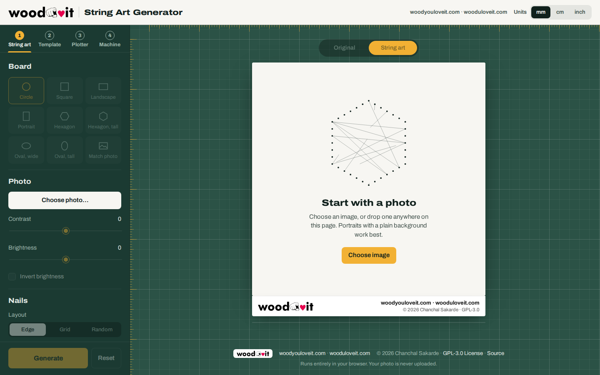 | 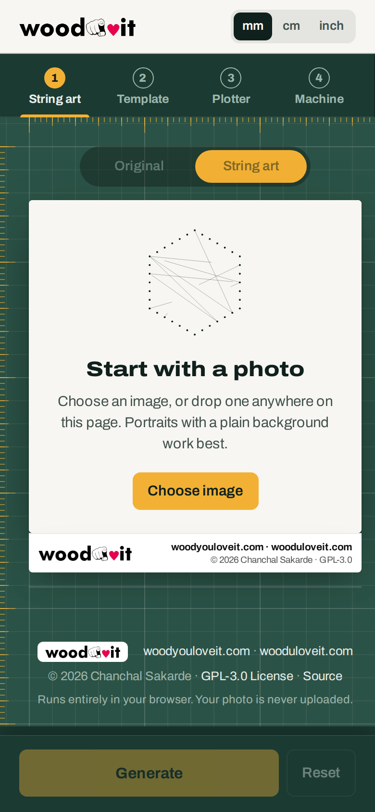 |

---

## Step 1: String art

1. Click **Choose image** in the middle of the board, or drop a photo anywhere on the page. (Later, use **Choose photo…** in the Photo section to swap it.)
2. Pick a **board shape**, then scroll to zoom and drag to place the photo (pinch and drag on a phone).
3. Adjust **contrast** and **brightness** if needed, and set the **number of nails** and **lines** with the sliders.
4. Press **Generate** and watch the thread being drawn. **Pause** stops it; **Continue** finishes the same run.
5. When it is done the button becomes **Next: Template →**. The number of lines is fixed for this run; press **Reset** to start over with different settings.

Flip the board with **Original / String art** (or press **F**) to compare the art with your photo.

| Photo placed | Art finished | Original side |
| --- | --- | --- |
| 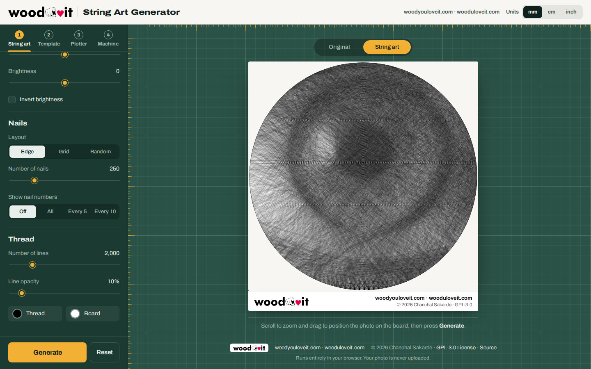 |  | 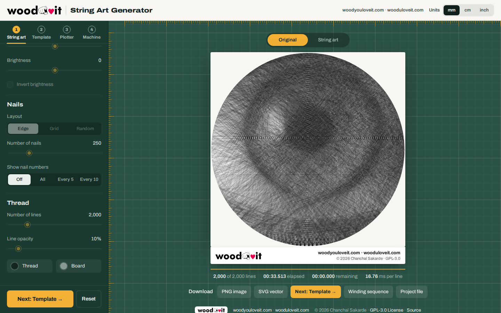 |

| Mobile: art | Mobile: settings |
| --- | --- |
| 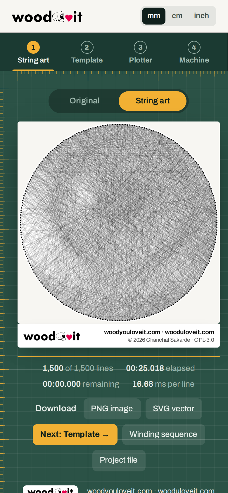 | 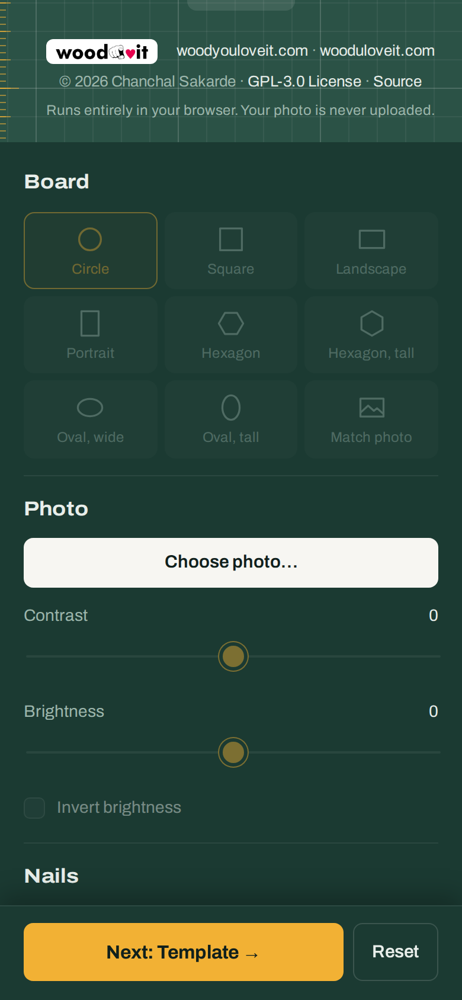 |

Downloads: **PNG image**, **SVG vector**, **Winding sequence** (the nail order as text) and **Project file**. Every export carries the woodyouloveit logo and copyright.

---

## Step 2: Template

The template uses your art's board automatically ("Using your string art: …").

1. Under **Size**, enter your **XY plotter workable area** (X and Y travel). The board can never be set larger than this; if a different shape would not fit, the board is reduced automatically and the tab tells you.
2. Set the **board size** (longest side) with the slider and how far the **nails sit from the edge**.
3. Choose **pin numbers** (every nail, every 5th or every 10th) and the **paper**: one actual-size sheet for a print shop, or A4 / A3 / Letter pages to tape together.
4. **Download PDF** (or SVG / PNG), print at 100% and check the 100 mm scale bar with a ruler.
5. **Next: Plotter →**

| Desktop | Mobile |
| --- | --- |
|  | 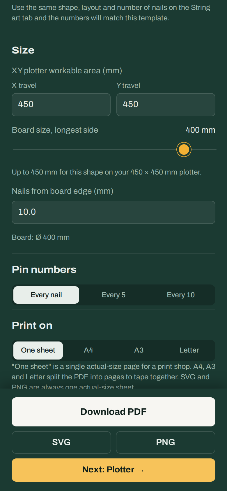 |

---

## Step 3: Plotter

G-code for a GRBL XY plotter, built from the same board.

1. **Machine:** where work zero (X0 Y0) sits on the board (the red X/Y arrows on the preview), which way Y points, offsets and travel speed.
2. **Job 1: nail positions:** pen, Z-axis (a negative Z with "Dot" drills pilot holes) or laser; mark style; optional pin numbers.
3. **Job 2: thread winding:** guide height, nail and guide diameters, wrap radius and direction, and pauses to check tension. The tab warns you if the wrap radius does not fit your nail spacing or if the job is bigger than your plotter.
4. Use **Play toolpath** to watch the path, download the G-code if you use another sender, or press **Next: run on the machine →**.

| Desktop | Mobile |
| --- | --- |
| 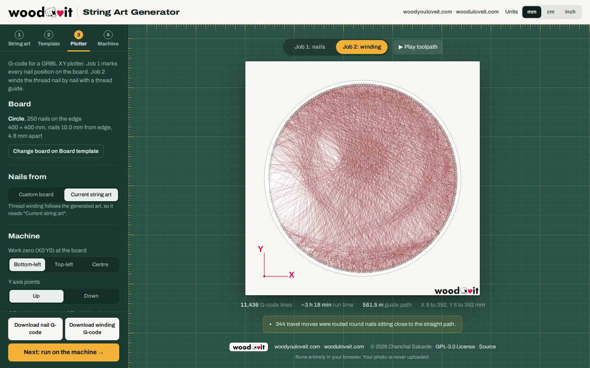 | 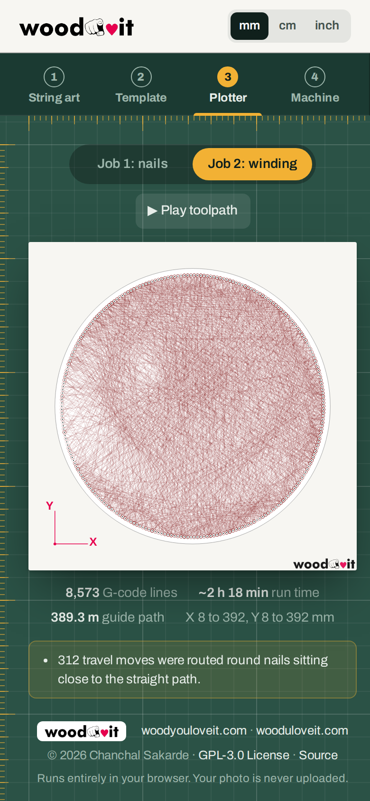 |

---

## Step 4: Machine

Run the plotter from the page over USB (Chrome or Edge on a computer). The **Simulator** lets you rehearse without hardware.

1. **Connect:** choose USB / COM port and the baud rate (115200 for GRBL 1.1), press **Connect** and pick the board's port. Close other programs that use the port first.
2. **Jog** the pen or guide over the work-zero point, lower Z to the board surface, and press **Zero all**.
3. Use **← Previous / Next →** to step between **Job 1 (nails)** and **Job 2 (winding)**. Tick **Dry run in check mode** to let GRBL check every line without moving.
4. **Start** asks for a quick safety check. During the job: **Pause**, **Resume**, and **Stop** (holds first, then resets, so the machine keeps its position).
5. Job 2 pauses for you to tie on the thread, at the tension checks you chose, and to tie off. The message appears with a **Resume** button.
6. The **console** accepts any command; quick buttons show settings (`$$`), offsets (`$#`), parser state (`$G`) and build info (`$I`). Errors and alarms are explained in plain English.

| Job 1 finished, Next → Job 2 | Start confirmation |
| --- | --- |
| 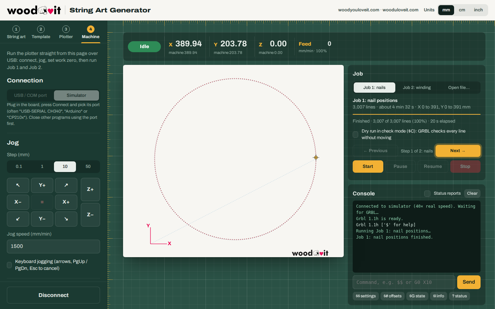 | 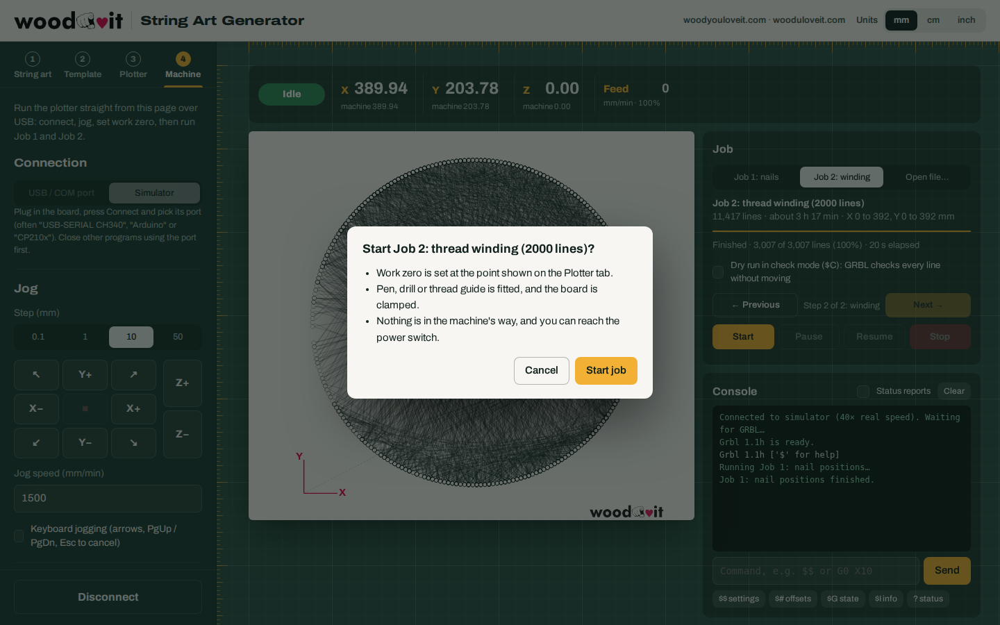 |

| Paused: tie the thread | Winding in progress |
| --- | --- |
| 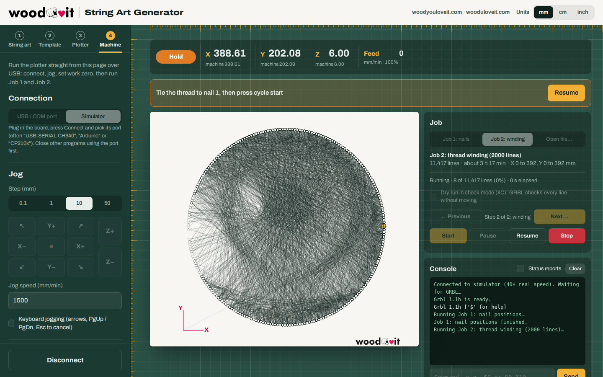 | 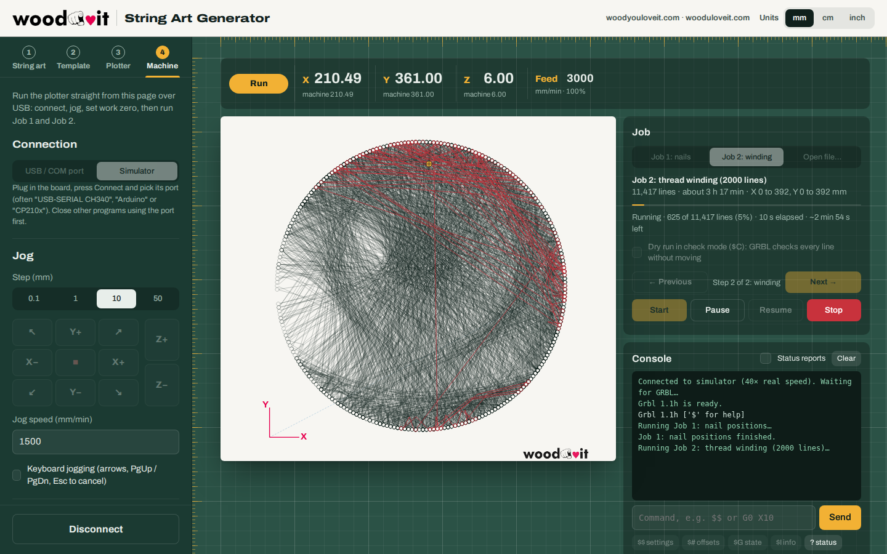 |

| Mobile: status | Mobile: job |
| --- | --- |
| 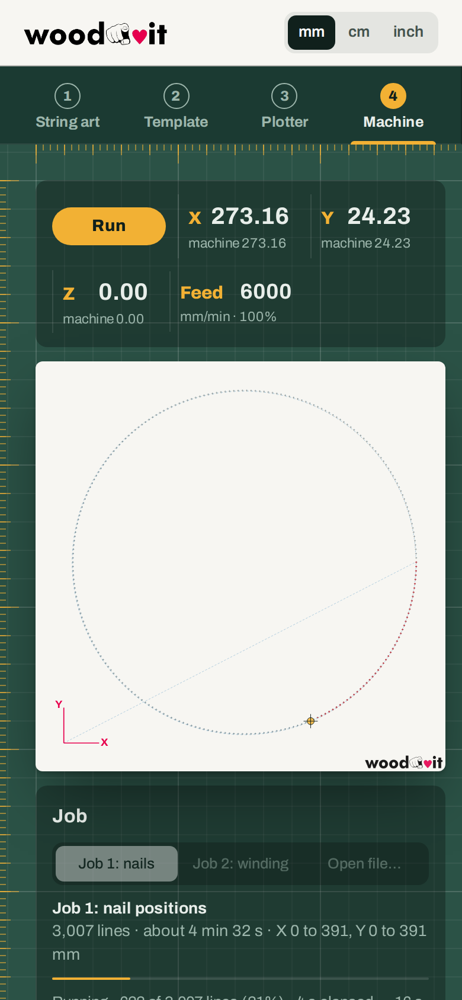 | 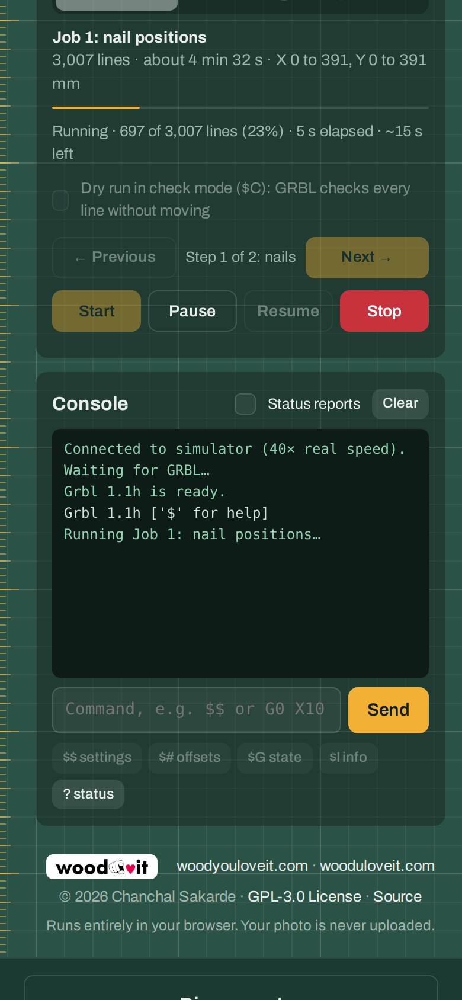 |

---

### Safety

Keep a hand near the machine's power switch on the first run of each job, run Job 1 with the pen lifted first to check the travel, and try Job 2 on a short art (about 100 lines) on scrap before a full board.
